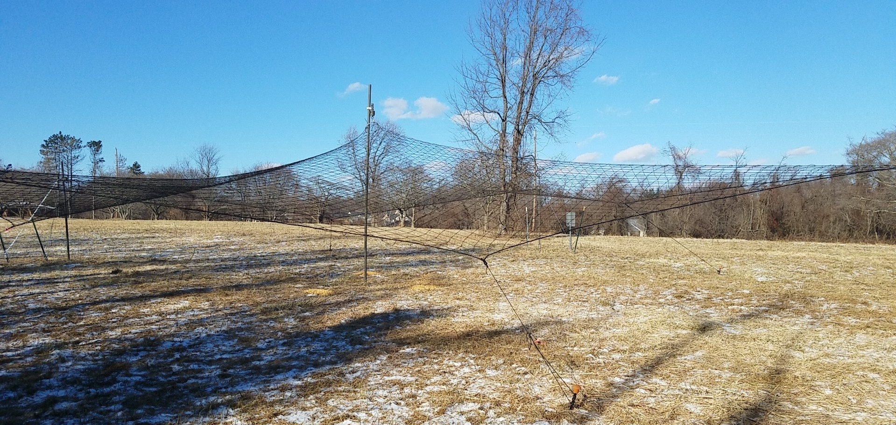
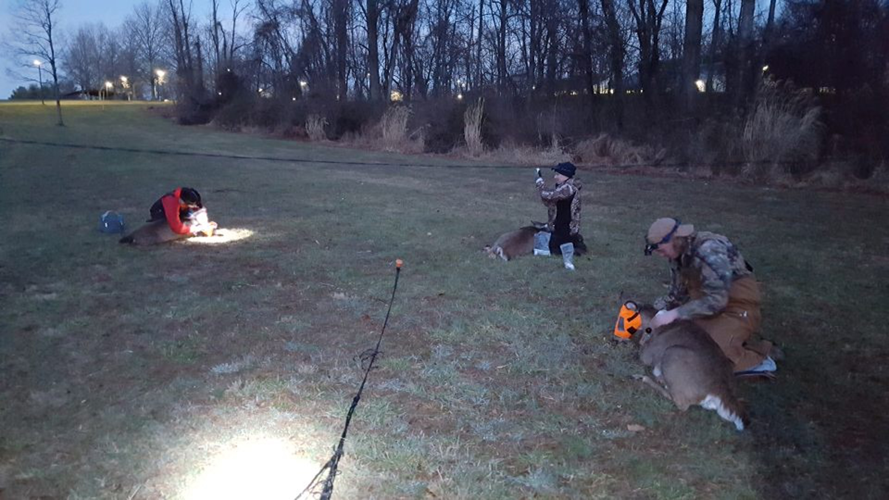
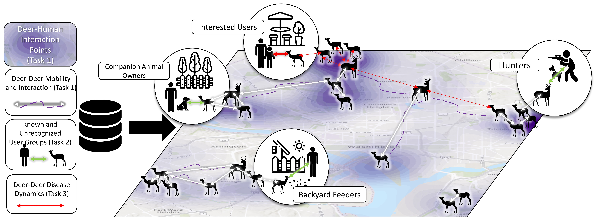
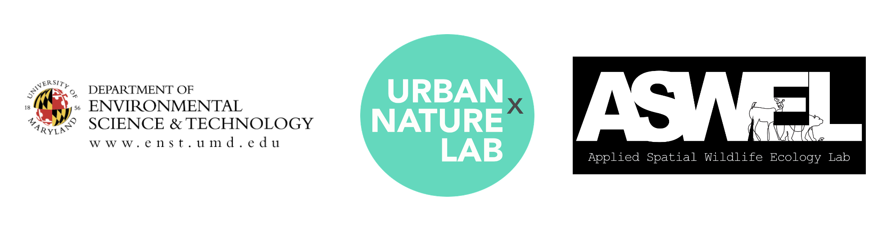

```{r setup, include=FALSE}
knitr::opts_chunk$set(echo = FALSE)
```

<style>
d-title, d-byline {
  display: none
}
</style>

<br>

````{r, fig.align = "center", out.width = "75%"}
knitr::include_graphics("images/projects/deer.JPG")
```

### **Para reportar un venado herido con collar, email tgallo@umd.edu y wildlife@umd.edu**

[Click to read this page in English](https://urbanxnaturelab.com/urban-deer-study.html)

# Dinámicas de movimiento y enfermedades zoonóticas en venados en áreas urbanas

Los venados cola blanca son una especie común y con alta distribución que comúnmente se encuentra en densidades altas en centros urbanos y sub-urbanos. La alta densidad poblacional tanto de venados como de humanos en centros urbanos incrementa el potencial para las interacciones entre humanos y venados, y subsecuentemente, el potencial para la transmisión de enfermedades entre ambas especies. El laboratorio URBANxNATURE y el laboratorio de Ecología y Vida Silvestre Espacial Aplicada de la Universidad de Maryland, y en colaboración con el Departamento de Agricultura de EEUU, Servicio de Parques Nacionales de EEUU, el Departamento de Energía y Ambiente de Washington D.C., Autoridad de Parques del condado de Fairfax , y los Parques de Montgomery, han comenzado un estudio acerca del potencial de transmisión de enfermedades entre humanos y venados en ambientes urbanos. Para este proyecto, usaremos el virus del SARS-CoV-2 como un estudio de caso.
 
Nuestro primer objetivo es identificar donde y cuando los humanos y venados están en contacto cercano. Para lograr eso, vamos a capturar y colocar collares con GPS a venados cola blanca en Washington D.C. y en las áreas urbanas del condado de Montgomery, Maryland y en el condado de Fairfax, Virginia. Luego combinaremos los datos del movimiento de venados junto con datos de movilidad de humanos para identificar en donde los humanos y los venados comparten el mismo espacio y están activos al mismo tiempo.

Capturaremos venados usando redes de caída (Fig. 1) en Washington D.C. y el condado de Montgomery. Usted podría llegar a ver una red similar a la de la foto siguiente, pero le pedimos que por favor no se acerca y no toque la red. 

````{r, fig.align = "center", out.width = "75%", fig.cap="Ejemplo de una red de caída similar a las que serán usadas para capturar venados en la región de Washington D.C.  "}

```

Una vez capturados, profesionales entrenados anestesiarán a cada venado, tomarán muestras de hisopados nasales y orales, y colocarán collares GPS a los venados (Fig. 2). Los signos vitales y la salud de cada venado será continuamente monitoreado mientras la investigación esté en curso. Una vez el collar haya sido colocado en el venado, entonces se revertirá la anestesia y el venado será liberado. Los venados serán monitoreados hasta que se metan en el bosque y regresen a su actividad normal. Cada venado al que se le colocó un collar será estudiado por los siguientes 2 años.

````{r, fig.align = "center", out.width = "75%", fig.cap="Biólogos colocando un collar GPS en un venado cola blanca."}

```

También queremos identificar diferentes grupos de personas que residen en áreas urbanas que están en contacto cercano con venados para poder clasificar los diferentes tipos de interacciones entre humanos y venados. Conduciremos diferentes tipos de observaciones de campo y entrevistas en áreas donde el traslape entre humanos y venado sea alto para poder documentar los diferentes tipos de interacciones (ej. alimentación, guardar distancia, interacciones con mascotas) y proveer un contexto a estas interacciones (ej. Caminadores de perros, viajeros de trabajo activos, trabajadores públicos). 

Finalmente, toda esta información será usada para desarrollar e implementar un modelo basado en agentes (Fig. 3) que nos permitirá predecir 1) cuándo y dónde los humanos y venados están en contacto cercano, 2) el contexto de dichas interacciones, y 3) el riesgo de transmisión de enfermedades. 

````{r, fig.align = "center", out.width = "75%", fig.cap="Diagrama conceptual del modelo basado en agentes."}

```

El potencial para la transmisión de enfermedades zoonóticas es alto para humanos que llegan a estar en contacto directo y frecuente con vida silvestre, y especialmente en ambientes urbanos donde las densidades tanto de humanos como de vida silvestre son altas. La naturaleza de las interacciones humano-vida silvestre en ambientes urbanos ha sido poco estudiada comparada con aquella en ambientes rurales (con cazadores, industrias animales). De esta manera, entendiendo la frecuencia y la naturaleza de las interacciones humanas-vida silvestre en ambientes urbanos, y los riesgos de enfermedades zoonóticas para humanos es crítico identificar intervenciones efectivas para prevenir la transmisión de dichas enfermedades en la interface humanos-vida silvestre. 

A medida que el proyecto avanza, incluiremos avances de la investigación en esta página e incluiremos algunos mapas interactivos del movimiento de venados a través de la ciudad. Mientras tanto, siéntase en libertad de enviarnos un email en caso tuviera preguntas del proyecto de investigación. 


````{r, fig.align = "center", out.width = "100%"}

```
