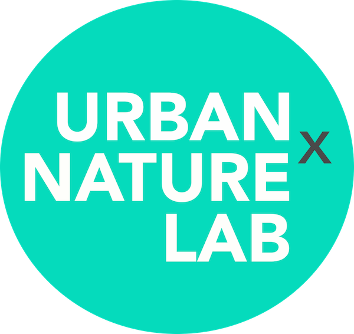

```{r setup, include=FALSE}
knitr::opts_chunk$set(echo = FALSE)
```

<style>
d-title, d-byline {
  display: none
}
</style>

<br>

````{r, fig.align = "center", out.width = "40%"}

```

We are a conservation science lab in the [Department of Environmental Science and Policy](https://science.gmu.edu/academics/departments-units/environmental-science-policy) at [George Mason University](https://www2.gmu.edu/). Our lab envisions cities where nature and people thrive together. Our mission is to undertake scientific research that supports ecological and conservation-minded urban design, planning, and policy. We use theories and principles in ecology and conservation science to provide evidence-based solutions that simultaneously conserve biological diversity and improve the lives of urban residents.

<h2>Recent Lab News</h2>
  
**05-25-2021:** Dan, Merri, Kate, and Travis all have talks at the [2021 International Urban Wildlife Conference](https://web.cvent.com/event/f929de7e-31c5-4f29-914e-558bfd1d0c56/summary)

**04-05-2021:** Kay received the [DoD SMART Scholarship](https://www.smartscholarship.org/smart)!!

**04-01-2021:** Excited to announce that Kay Pontarelli and Alexia Yau will be joining the lab in Fall 2021

**03-15-2021:** Kate was awarded the [ESA Graduate Student Policy Award](https://www.esa.org/blog/2021/03/15/esa-selects-2021-graduate-student-policy-award-recipients/)

**03-15-2021:** Both Merri and Angela were awarded [2021 Trees Virginia Academic Scholarships](https://treesvirginia.org/outreach/scholarships#:~:text=2021%20Trees%20Virginia%20Academic%20Scholarships%20Awarded!&text=In%20support%20of%20these%20efforts,awarded%20over%20%2452%2C000%20in%20scholarships.)!


