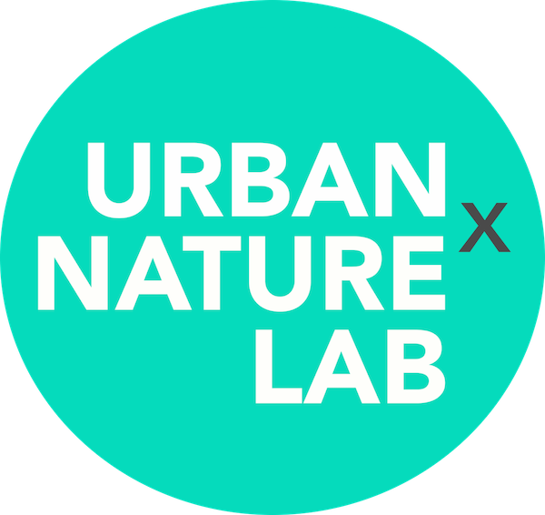

```{r setup, include=FALSE}
knitr::opts_chunk$set(echo = FALSE)
```

<style>
d-title, d-byline {
  display: none
}
</style>

<br>

```{r, fig.align = "center", out.width = "40%"}

```

We are a conservation science and quantitative ecology lab in the [Department of Environmental Science and Technology](https://enst.umd.edu/){target="_blank"} at the [University of Maryland](https://umd.edu/){target="_blank"}. **Our lab envisions cities where nature and people thrive together.** Our mission is to undertake scientific research that supports ecological and conservation-minded urban design, planning, and policy. We use theories and principles in ecology and conservation science to provide evidence-based solutions that simultaneously conserve biological diversity and improve the lives of urban residents.

<h2>Recent Lab News</h2>

**03-15-2026:** PhD student, Colleen O'Donnell, received the University **Outstanding Graduate Student Award** for 2025-2026 academic year!

**02-17-2026:** New paper alert!! Check out our recent study, led by undergrad Jess Nadler, on the distribution of street trees in Washington, D.C. and how it they relate to ecological and social variables. Open Access [here](https://www.sciencedirect.com/science/article/pii/S1618866726000890?via%3Dihub) in *Urban Forestry & Urban Greening*.

**01-29-2026:** Excited to share a new paper led by PhD student, Adam Pekor. Check out our latest work on Conservation Incentive Payments to promote human carnivore coexistence published [here](https://conbio.onlinelibrary.wiley.com/doi/10.1111/cobi.70216) in *Conservation Biology*!
