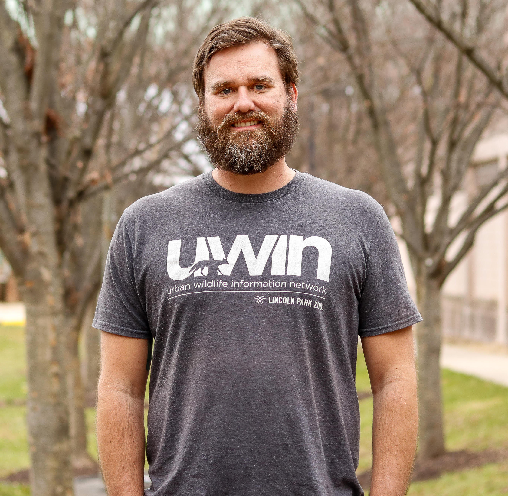
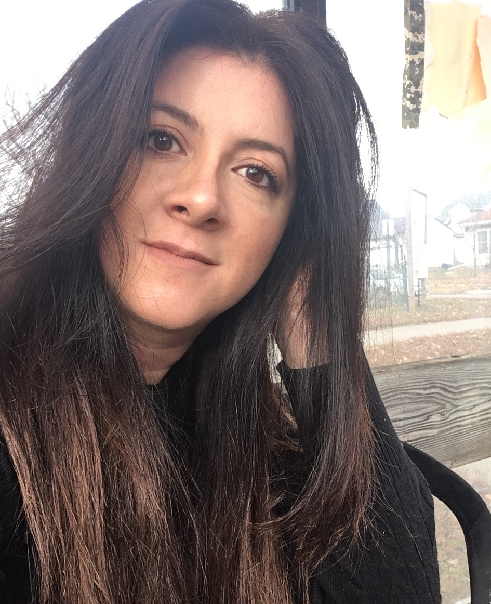
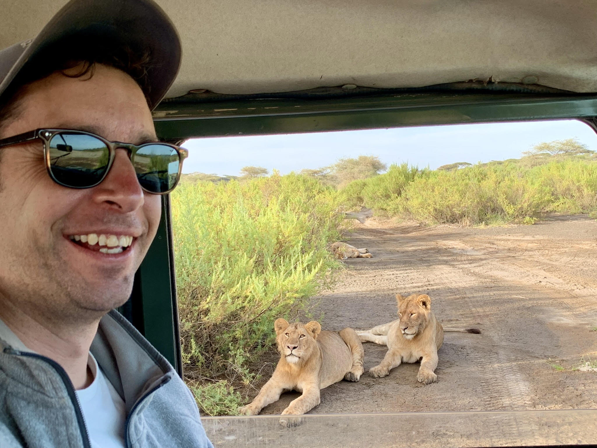
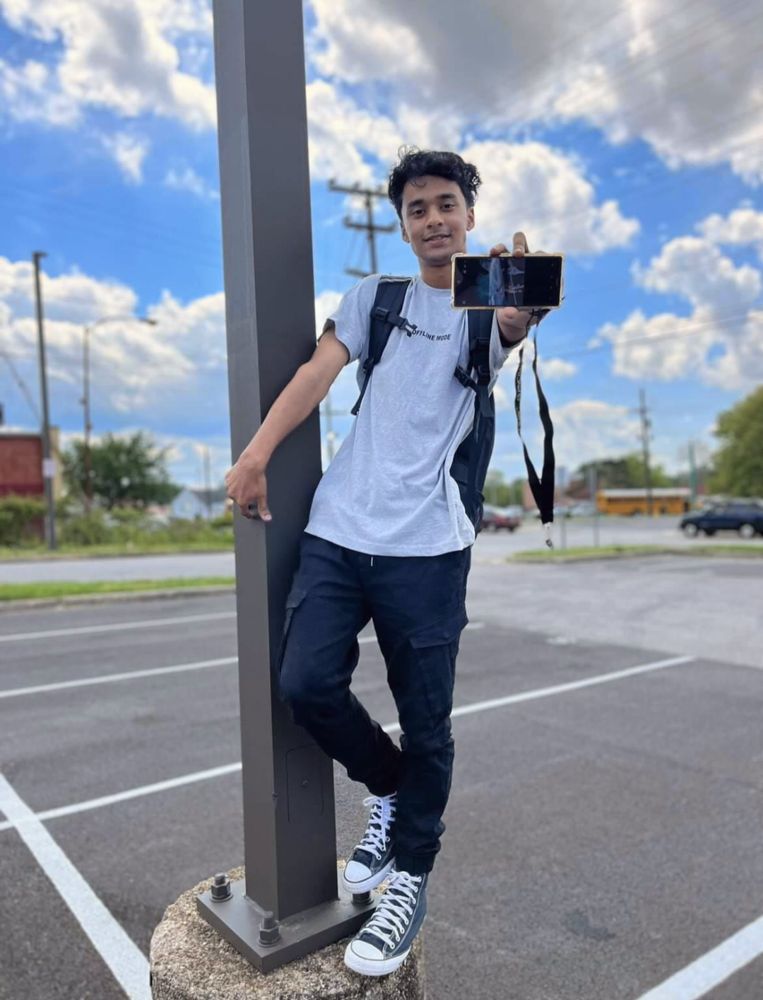
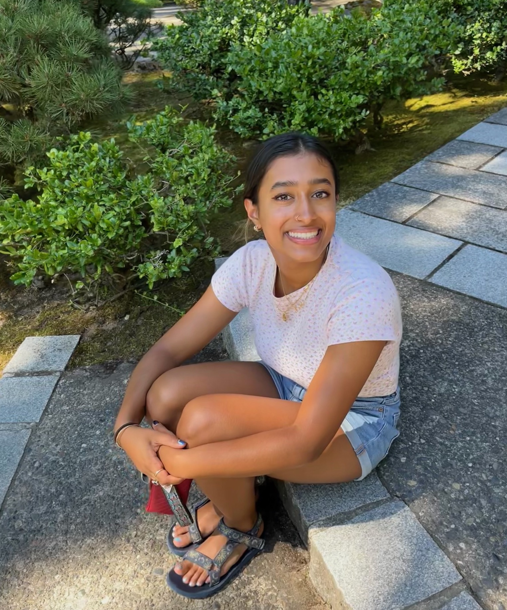

```{r setup, include=FALSE}
knitr::opts_chunk$set(echo = FALSE)
```

<style>
d-title, d-byline {
  display: none
}
</style>

<br>

## Principal Investigators

{width=50%}

### Travis Gallo, Assistant Professor
[Google Scholar](https://scholar.google.com/citations?user=RaEz6G8AAAAJ&amp;hl=en){target="_blank"} | [Research Gate](https://www.researchgate.net/profile/Travis_Gallo){target="_blank"} | [CV](publications/2023-01-05_CV_Gallo.pdf) | [GitHub](https://github.com/TravisGallo)

Travis Gallo is an Assistant Professor in Urban Ecology and Conservation and is the lab PI. Travis works to understand how urban environments shape species distributions, populations, communities, and behaviors. The goal of his research is to provide evidence-based solutions that simultaneously conserve biological diversity and improve the lives of urban residents.


## Postdoctoral Scholars

{width=40%}

### Gabby Palomo, Postdoctoral Researcher

[Gabby's personal website](https://gabspalomo.github.io/)

I am a postdoctoral researcher working on a 2-year research project to understand potential areas of interactions between humans and white-tailed deer using camera traps and human mobility data across multiple US cities. Deer are a species of interest in understanding spillover risk between humans and wildlife since multiple studies have identified SARS-CoV-2 infections in white-tailed deer. I got my PhD from the University of Nebraska Lincoln in 2022, working with Andrew J Tyre (advisor). My background is in carnivore ecology, specifically ocelot populations in Guatemala. I am interested in studying the impacts of human activities on wildlife and their effects on population dynamics, behavior, and wildlife-habitat relationships. However, I spend so much time learning about Bayesian models that I'm starting to question my priors in ecology. I'm originally from Guatemala and have previously worked in natural history collections, teaching undergraduate-level classes, and orchid and bromeliad horticulture. 

## Graduate Students

{width=40%}

### Merri Collins, Ph.D. Candidate

I am a graduate student in the Environmental Science and Policy Program at George Mason. I have worked with a variety of species in past positions as a wildlife conservation biologist, everything from herpetofauna to marine mammals. I am interested in human/wildlife conflict mitigation, understanding drivers of local habitat and species losses, and how we can reduce these through practical application and management. At Mason I will be starting the National Capital’s first large-scale, and long-term urban wildlife monitoring project.

<br>

{width=40%}

### Dan Herrera, Ph.D. Student

[Dan's personal website](https://www.herrerawildlife.com/)

I am a graduate student in Environmental Science and Technology at the University of Maryland. My research experience has broadly focused on animal behavior and urban ecology. During the winter of 2017 and summer of 2018, I worked with Dr. Gallo at the Urban Wildlife Institute in Chicago, IL. I have since moved to Washington, DC, to survey the Capitol’s wildlife through a collaboration between the Humane Rescue Alliance and the Smithsonian Conservation Biology Institute. I am thrilled to continue working with Dr. Gallo as we use these data to better understand wildlife response to urbanization on a fine scale. I am interested in dynamic interactions between the anthropogenic and natural landscapes that influence urban wildlife, and the resulting potential human-wildlife conflict.

<br>

{width=40%}

### Adam Pekor, Ph.D. Student

I am a graduate student in Environmental Science and Technology with a background in law. My research focuses on human-wildlife coexistence and lion population connectivity in northern Tanzania. Working with a local conservation organization called KopeLion, I helped develop a conservation incentive payment program to mitigate human-lion conflict in a key protected area. I am now studying the impacts of this program and lion population connectivity across the region to help understand the most effective tools for engaging communities, facilitating connectivity, and promoting coexistence in shared landscapes.

## Undergraduate Students

{width=40%}

### Jishan Chowdhury, Research Assistant

I am an undergrad student in the Environmental Science And Technology program at the University Of Maryland with a concentration in Ecological Tech Design. I have always been very passionate about the environment and how humans affect the environment. My dream is to see an environmently friendly world.

<br>

{width=40%}

### Lara Abedin, Research Assistant

I'm an undergraduate student majoring in Environmental Science and Policy, with a concentration in Biodiversity and Conservation Biology. I love learning about ecology and how different organisms play an integral role to the overall health of an ecosystem. I am interested in conservation and finding sustainable solutions to current environmental problems.


## Lab Alumni

### Graduate Students:

**Krista Shires** - Ph.D. (2020-2023). Currently at George Mason University

**Hannah Wood** - M.S. (2022-2023). Currently at Children's Science Center, Fairfax

**Kay Pontarelli** - M.S. (2021-2023). Currently at U.S. Army Aberdeen Proving Ground

**Angela Gaal** - M.S. (2019-2021). Currently at Lord Green Strategies

**Kate Ritzel** - M.S. (2019-2021). Currently at U.S.G.S.

**Nick Moreno** - PhD student on rotation (2020)

### Undergraduate Students:

**Faith Kruger** - Undergraduate Research Assistant (2020-2022)

**Tristan Silva-Montoya** - Undergraduate Research Assistant (2020-2022)

**Alix Upchurch** - Undergraduate Research Assistant (2022)

**Roberto Aguilar-Rojas** - Undergraduate Research Assistant (2021)

**Khanh Nguyen** - Undergraduate Research Assistant (2020)

**Melissa Irahet** - Undergraduate Research Assistant (2020)

**Daniel Marzluff** - Undergraduate Research Assistant (2020)