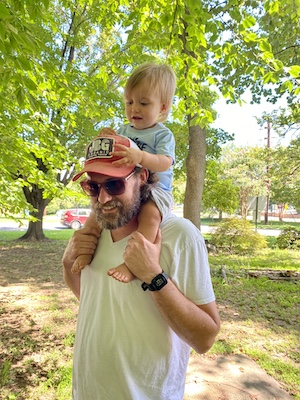
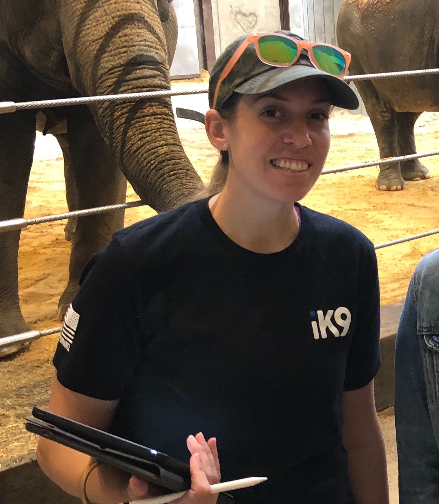
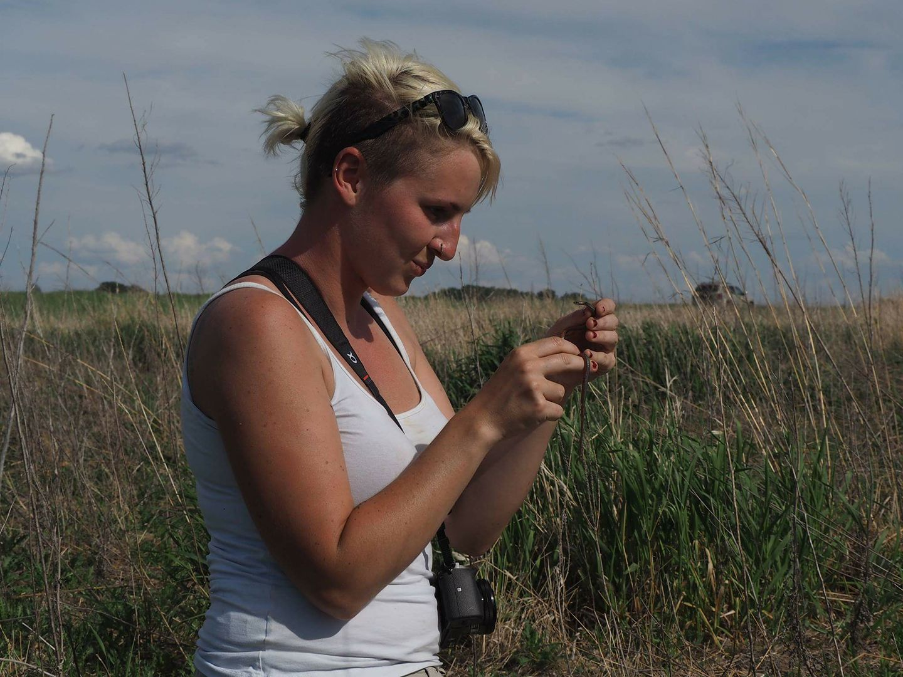
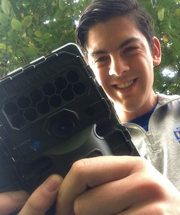
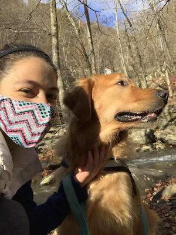
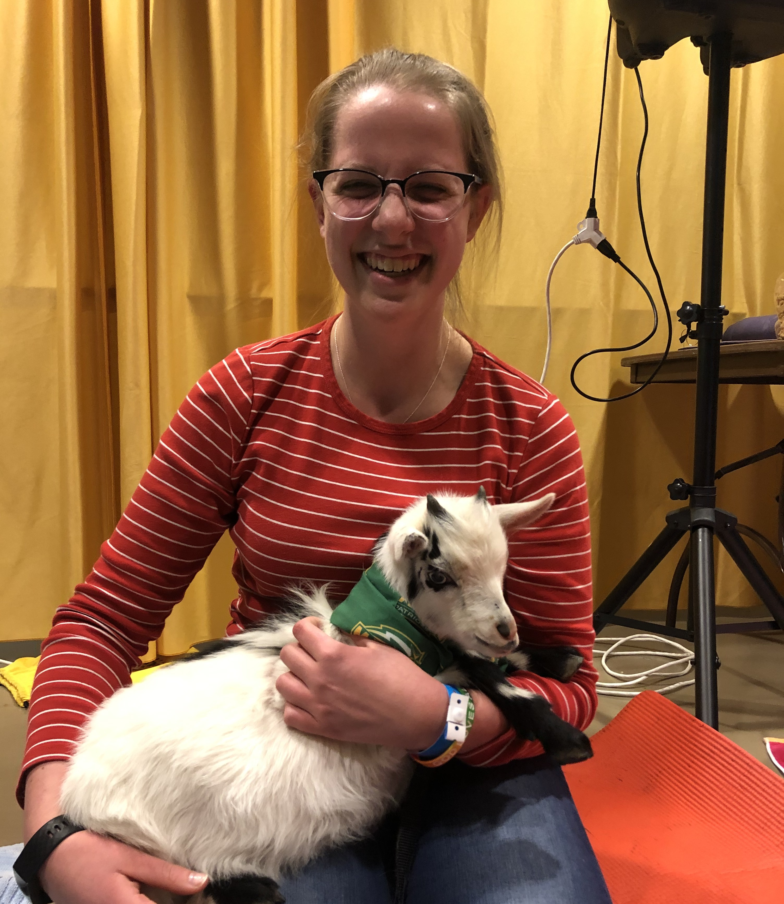
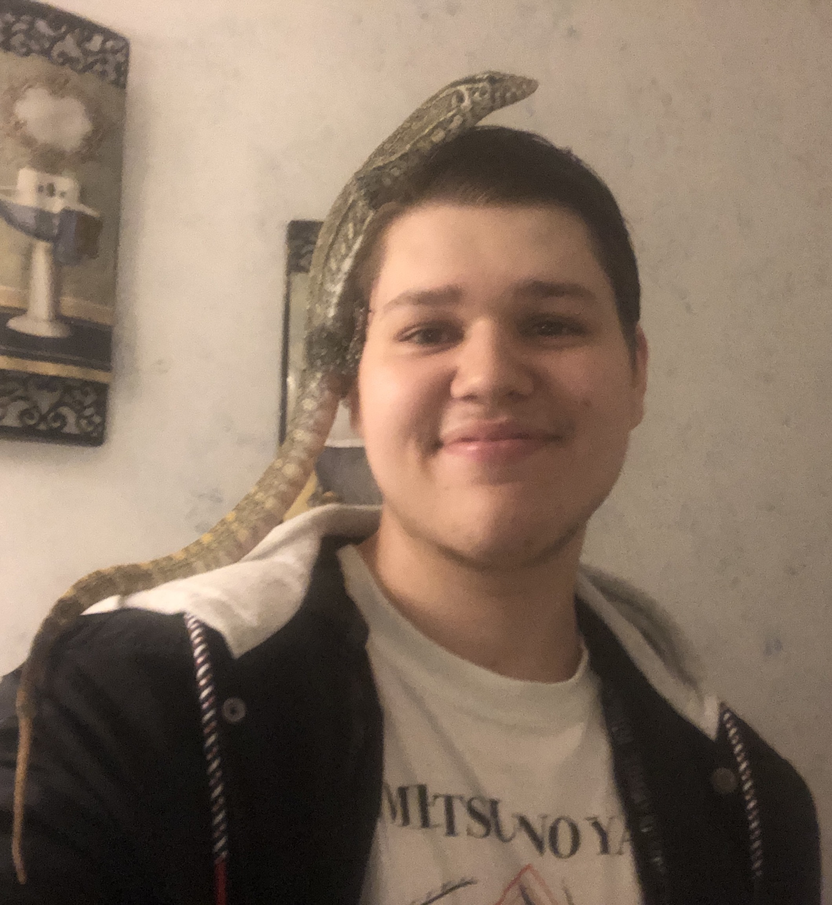

```{r setup, include=FALSE}
knitr::opts_chunk$set(echo = FALSE)
```

<style>
d-title, d-byline {
  display: none
}
</style>

<br>

## Principal Investigators

{width=50%}

### Travis Gallo, Assistant Professor
[Google Scholar](https://scholar.google.com/citations?user=RaEz6G8AAAAJ&amp;hl=en) | [Research Gate](https://www.researchgate.net/profile/Travis_Gallo) | [CV](publications/2021-05-18_CV_Gallo.pdf)

Travis Gallo is an Assistant Professor in Urban Ecology and Conservation and is the lab PI. Travis works to understand how urban environments shape species distributions, populations, communities, and behaviors. The goal of his research is to provide evidence-based solutions that simultaneously conserve biological diversity and improve the lives of urban residents.

## Graduate Students

{width=50%}

### Krista Shires, Ph.D. Student

I am a PhD student in Environmental Science and Policy with a background in Psychology. My previous experiences as a veterinary technician, animal control officer, and zoo keeper-aide have all influenced my research. I am interested in the impact of urbanization on wildlife, specifically, how human interference alters predator-prey dynamics, stress, and behavioral patterns of local species. I am interested in utilizing citizen science to answer broader questions about landscape ecology and serve as a method of public education with the aim of fostering a connection between people and nature.

<br>

{width=50%}

### Merri Collins, Ph.D. Student

I am a graduate student in the Environmental Science and Policy Program at George Mason. I have worked with a variety of species in past positions as a wildlife conservation biologist, everything from herpetofauna to marine mammals. I am interested in human/wildlife conflict mitigation, understanding drivers of local habitat and species losses, and how we can reduce these through practical application and management. At Mason I will be starting the National Capital’s first large-scale, and long-term urban wildlife monitoring project.

<br>

{width=50%}

### Dan Herrera, Ph.D. Student

[Dan's personal website](https://www.herrerawildlife.com/)

I am a graduate student in Environmental Science and Policy at George Mason University. My research experience has broadly focused on animal behavior and urban ecology. During the winter of 2017 and summer of 2018, I worked with Dr. Gallo at the Urban Wildlife Institute in Chicago, IL. I have since moved to Washington, DC, to survey the Capitol’s wildlife through a collaboration between the Humane Rescue Alliance and the Smithsonian Conservation Biology Institute. I am thrilled to continue working with Dr. Gallo as we use these data to better understand wildlife response to urbanization on a fine scale. I am interested in dynamic interactions between the anthropogenic and natural landscapes that influence urban wildlife, and the resulting potential human-wildlife conflict.

<br>

{width=50%}

### Kay Pontarelli, M.S. Student

I’m a M.S graduate student in the Environmental Science and Policy Program at George Mason University (GMU), with a concentration in Conservation Science and Policy. My interests are within animal ecology in urbanized areas. My love for wildlife came from growing up as a military brat overseas with each transition presenting new habitats to explore. At GMU I’m studying insect community composition in residential yards to see how neighborhoods could provide beneficial habitat for insects. This would, in turn, affect nearby flora and fauna that depend on insects as food, pollinators, pest control, and decomposers, and decrease fragmentation caused by urbanization.

## Undergraduate Students

{width=50%}


### Hannah Wood, Accelerated M.S. Student

I am currently an undergraduate student, but will be pursuing a Master’s degree in environmental science with a concentration in conservation science and policy through the ESP Accelerated Master’s program. I have always been passionate about wildlife and taking care of the world around us. I am interested in how animal adaptations are changing in response to increasing urbanization.

<br>

{width=50%}

### Faith Kruger, Research Assistant

I am an undergraduate student majoring in Environmental Science with a concentration in wildlife. I have always been passionate about natural sciences and wildlife and love how this major combines both. I hope to be involved in the field of wildlife conservation and look forward to gaining research experience.

<br>

{width=50%}

### Tristan Silva-Montoya, Research Assistant
I'm an undergraduate student here at George Mason studying Environmental Science. I plan to concentrate in Wildlife, specifically herpetology. I have a strong passion for all wildlife that started when I was young and would go camping with my parents. Since that passion started I've always had pets in the house starting from geckos and turtles to chameleons and monitors along with the dogs of course. Growing up around a lot of animals really makes you curious about the intelligence and personality of those animals, hence my future goal of working in wildlife conservation or beneficial captive facilities used for breeding and awareness. I am more than excited for the opportunity of gaining experience and working towards something bigger than myself.

## Lab Alumni

### Graduate Students:

**Angela Gaal** - M.S. Student (2019-2021) Currently at Lord Green Strategies

**Kate Ritzel** - M.S. Student (2019-2021) Currently at U.S.G.S.

**Nick Moreno** – PhD student on rotation (2020)

### Undergraduate Students:

**Roberto Aguilar-Rojas** - Undergraduate Research Assistant (2021)

**Khanh Nguyen** – Undergraduate Research Assistant (2020)

**Melissa Irahet** – Undergraduate Research Assistant (2020)

**Daniel Marzluff** – Undergraduate Research Assistant (2020)