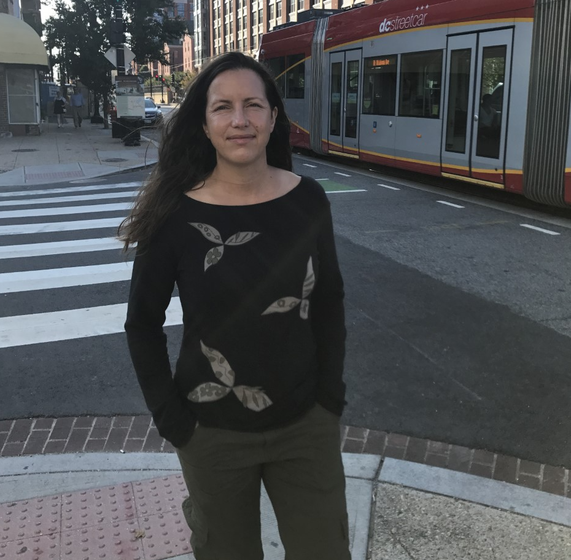
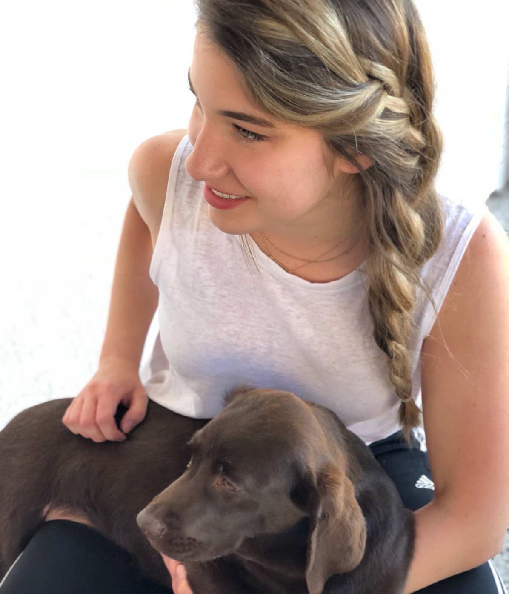
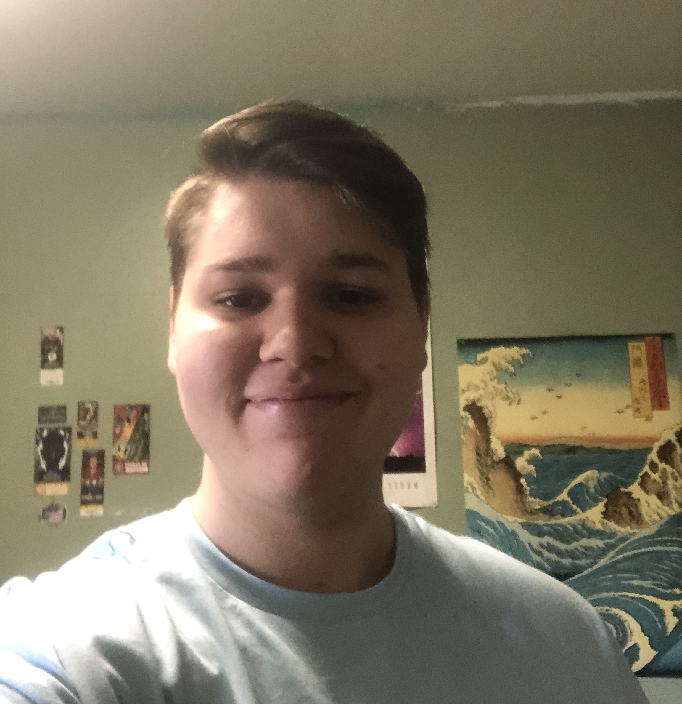
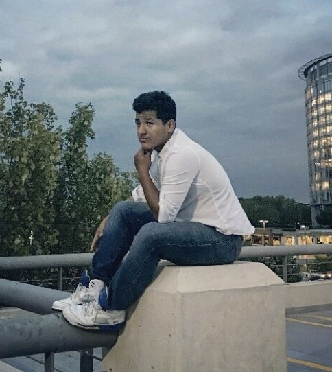

```{r setup, include=FALSE}
knitr::opts_chunk$set(echo = FALSE)
```

<style>
d-title, d-byline {
  display: none
}
</style>

<br>

## Principle Investigators

<div class="wrapper">

<div>
<br>

</div>

<div>
<h3>Travis Gallo, Assistant Professor
<a href="https://scholar.google.com/citations?user=RaEz6G8AAAAJ&amp;hl=en" target="_blank">Google Scholar</a> | <a href="https://www.researchgate.net/profile/Travis_Gallo" target="_blank">ResearchGate</a> | <a href="publications/2021-05-18_CV_Gallo.pdf">CV</a></h3>

<p>Travis Gallo is an Assistant Professor in Urban Ecology and Conservation and is the lab PI. Travis works to understand how urban environments shape species distributions, populations, communities, and behaviors. The goal of his research is to provide evidence-based solutions that simultaneously conserve biological diversity and improve the lives of urban residents.</p>
</div>
</div>

## Graduate Students

<div class="wrapper">

<div>
<br>

</div>

<div>
<h3>Kate Ritzel, M.S. Student</h3>
<p>As an MS student in Mason’s Environmental Science and Policy Program, I have the opportunity to work with Travis Gallo and fellow graduate students exploring urban ecology, specifically in the DC metro area. I research behavioral changes in urban coyotes and raccoons by examining behavioral response to novel stimuli in urban vs. rural populations. My internship with the US Fish & Wildlife Service (Ecological Services Program) and on-going work with USGS (Land Change Science and Climate R&D) have bolstered my deep commitment to ecological research as I work towards mutually beneficial, practical solutions to conserve biodiversity.</p>
</div>

<div>
<br>

</div>

<div>
<h3>Krista Shires, Ph.D. Student</h3>
<p>I am a PhD student in Environmental Science and Policy with a background in Psychology. My previous experiences as a veterinary technician, animal control officer, and zoo keeper-aide have all influenced my research. I am interested in the impact of urbanization on wildlife, specifically, how human interference alters predator-prey dynamics, stress, and behavioral patterns of local species. I am interested in utilizing citizen science to answer broader questions about landscape ecology and serve as a method of public education with the aim of fostering a connection between people and nature.</p>
</div>

<div>
<br>

</div>

<div>
<h3>Merri Collins, Ph.D. Student</h3>

<p>I am a graduate student in the Environmental Science and Policy Program at George Mason. I have worked with a variety of species in past positions as a wildlife conservation biologist, everything from herpetofauna to marine mammals. I am interested in human/wildlife conflict mitigation, understanding drivers of local habitat and species losses, and how we can reduce these through practical application and management. At Mason I will be starting the National Capital’s first large-scale, and long-term urban wildlife monitoring project.</p>
</div>

<div>
<br>

</div>

<div>
<h3>Angela Gaal, M.S. Student</h3>

<p>I am an MS student in the School of Systems Biology at George Mason University. My past experience in a small animal veterinary clinic sparked my interest in animal behavior and conservation. My undergraduate research focused on social behaviors between male and female black swans before and after courtship. I currently work in a congressional office on Capitol Hill, focusing on natural resource policy and environmental issues. I am interested in the impact of urban development on climate regulation and biodiversity at large, specifically, how the distribution of ecosystem services throughout cities relates to business development. My research project uses urban forest canopy cover and vegetation data to answer broader questions about landscape management and action towards climate resiliency in the District of Columbia.</p>
</div>

<div>
<br>

</div>

<div>
<h3>Dan Herrera, Ph.D. Student</h3>

<p>I am a graduate student in Environmental Science and Policy at George Mason University. My research experience has broadly focused on animal behavior and urban ecology. During the winter of 2017 and summer of 2018, I worked with Dr. Gallo at the Urban Wildlife Institute in Chicago, IL. I have since moved to Washington, DC, to survey the Capitol’s wildlife through a collaboration between the Humane Rescue Alliance and the Smithsonian Conservation Biology Institute. I am thrilled to continue working with Dr. Gallo as we use these data to better understand wildlife response to urbanization on a fine scale. I am interested in dynamic interactions between the anthropogenic and natural landscapes that influence urban wildlife, and the resulting potential human-wildlife conflict.</p>
</div>

<div>
<br>

</div>

<div>
<h3>Kay Pontarelli, M.S. Student</h3>

<p>I’m a M.S graduate student in the Environmental Science and Policy Program at George Mason University (GMU), with a concentration in Conservation Science and Policy. My interests are within animal ecology in urbanized areas. My love for wildlife came from growing up as a military brat overseas with each transition presenting new habitats to explore. At GMU I’m studying insect community composition in residential yards to see how neighborhoods could provide beneficial habitat for insects. This would, in turn, affect nearby flora and fauna that depend on insects as food, pollinators, pest control, and decomposers, and decrease fragmentation caused by urbanization.</p>
</div>

</div>

## Undergraduate Students

<div class="wrapper">

<div>
<br>

</div>

<div>
<h3>Hannah Wood, Accelerated M.S. Student</h3>
<p>I am currently an undergraduate student, but will be pursuing a Master’s degree in environmental science with a concentration in conservation science and policy through the ESP Accelerated Master’s program. I have always been passionate about wildlife and taking care of the world around us. I am interested in how animal adaptations are changing in response to increasing urbanization.</p>
</div>

<div>
<br>

</div>

<div>
<h3>Faith Kruger, Research Assistant</h3>
<p>I am an undergraduate student majoring in Environmental Science with a concentration in wildlife. I have always been passionate about natural sciences and wildlife and love how this major combines both. I hope to be involved in the field of wildlife conservation and look forward to gaining research experience.</p>
</div>

<div>
<br>

</div>

<div>
<h3>Tristan Silva-Montoya, Research Assistant</h3>
<p>I am a freshman at GMU majoring in Environmental Science, planning to choose a concentration in wildlife. I have always been drawn to animals and studying them, and have a strong interest in herpetology. The reason I love herpetology is that I have always had reptiles as pets growing up starting with Leopard Geckos and turtles, then getting a chameleon, and finally getting a Nile monitor! My monitors name is Zabuza and I love studying how he reacts to me and everything else (he studies me back, I swear). I hope to make a career on caring for or studying the behavior of reptiles and amphibians alike.</p>
</div>

<div>
<br>

</div>

<div>
<h3>Roberto Aguilar-Rojas, Research Assistant</h3>
<p>I am currently a senior at George Mason University, and I will be graduating with a Bachelor of Science in Biology. After graduation, I plan on applying to dental school and pursuing a career in the field of orthodontics or cosmetic dentistry. During my free time, I love to pursue my passions in the natural sciences and wildlife conservation. Some of my hobbies include watching the NBA, singing, and cooking. My favorite team in the NBA is the Washington Wizards. When signing, I prefer acoustic songs, and my favorite cuisine is Italian!</p>
</div>

</div>

## Lab Alumni

**Nick Moreno** – PhD student on rotation (2020)

**Khanh Nguyen** – Undergraduate Research Assistant (2020)

**Melissa Irahet** – Undergraduate Research Assistant (2020)

**Daniel Marzluff** – Undergraduate Research Assistant (2020)