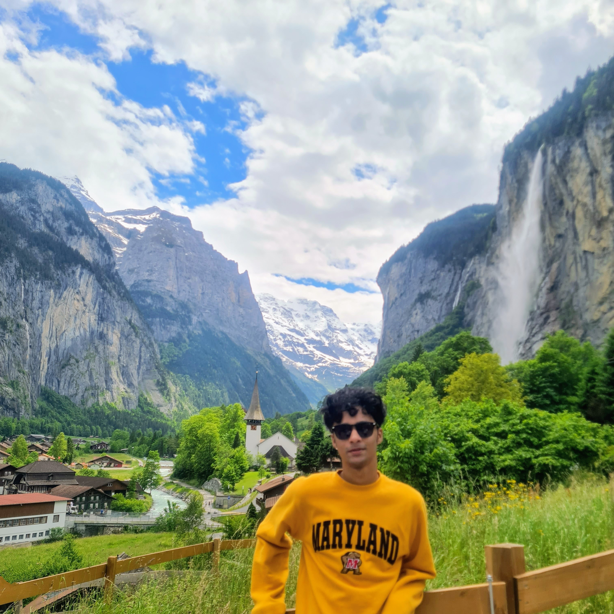

```{r setup, include=FALSE}
knitr::opts_chunk$set(echo = FALSE)
```

<style>
d-title, d-byline {
  display: none
}
</style>

<br>

## Principal Investigators

{width=50%}

### Travis Gallo, Assistant Professor
[Google Scholar](https://scholar.google.com/citations?user=RaEz6G8AAAAJ&amp;hl=en){target="_blank"} | [Research Gate](https://www.researchgate.net/profile/Travis_Gallo){target="_blank"} | [CV](publications/2023-11-28_CV_Gallo.pdf) | [GitHub](https://github.com/TravisGallo)

Travis Gallo is an Assistant Professor in Urban Ecology and Conservation and is the lab PI. Travis works to understand how urban environments shape species distributions, populations, communities, and behaviors. The goal of his research is to provide evidence-based solutions that simultaneously conserve biological diversity and improve the lives of urban residents.


## Postdoctoral Scholars

{width=40%}

### Gabby Palomo, Postdoctoral Researcher

[Gabby's personal website](https://gabspalomo.github.io/)

I am a postdoctoral researcher working on a 2-year research project to understand potential areas of interactions between humans and white-tailed deer using camera traps and human mobility data across multiple US cities. Deer are a species of interest in understanding spillover risk between humans and wildlife since multiple studies have identified SARS-CoV-2 infections in white-tailed deer. I got my PhD from the University of Nebraska Lincoln in 2022, working with Andrew J Tyre (advisor). My background is in carnivore ecology, specifically ocelot populations in Guatemala. I am interested in studying the impacts of human activities on wildlife and their effects on population dynamics, behavior, and wildlife-habitat relationships. However, I spend so much time learning about Bayesian models that I'm starting to question my priors in ecology. I'm originally from Guatemala and have previously worked in natural history collections, teaching undergraduate-level classes, and orchid and bromeliad horticulture. 

<br>

{width=40%}

### Zehidul Hussain, Postdoctoral Researcher

I am a postdoctoral researcher interested in understanding animal movement and the drivers influencing their relationship with the environment. My interest further lies in the complexities of animal ecology, particularly predator-prey dynamics and human-wildlife interactions. Currently, I am engaged in a project that aims to understand the intricate dynamics between deer movement and human activities in increasingly urbanized landscapes. I hold a PhD in Wildlife Sciences from the Wildlife Institute of India and the Forest Research Institute, where my doctoral research focused on the movement ecology of tigers in a human-dominated landscape in India. My journey into wildlife research has been diverse, from studying small mammals to large carnivores in varied landscapes.


## Graduate Students

{width=40%}

### Adam Pekor, Ph.D. Student

I am a graduate student in Environmental Science and Technology with a background in law. My research focuses on human-wildlife coexistence and lion population connectivity in northern Tanzania. Working with a local conservation organization called KopeLion, I helped develop a conservation incentive payment program to mitigate human-lion conflict in a key protected area. I am now studying the impacts of this program and lion population connectivity across the region to help understand the most effective tools for engaging communities, facilitating connectivity, and promoting coexistence in shared landscapes.

<br>

{width=40%}

### Colleen O'Donnell, Ph.D. Student

I am a graduate student with the Environmental Science and Technology Department at the University of Maryland. My background is in wildlife conservation, community-based climate adaptation, combating wildlife crime, sustainable and wildlife-friendly livelihoods, and habitat restoration. I have worked on species and with communities in African forests, mountains, wetlands, and savannas and in high-mountain peatlands of the Himalayas and Andes. Through my PhD and beyond, I hope to contribute to addressing what I see as one of Earth’s most pressing existential threats—biodiversity loss. I am particularly interested in restoring ecosystems through reintroductions of keystone species, especially carnivores, and reducing human-wildlife conflict. I earned a bachelors in biology from the University of Notre Dame and a Masters in sustainable development from the University of London SOAS.

<br>

{width=40%}

### Matthew Payne, M.S. Student (co-advised with Dr. Jennifer Mullinax)

I am a graduate student in Environmental Science and Technology at the University of Maryland. I received my bachelor’s degree in Wildlife and Fisheries from Frostburg State University. I am currently working as a naturalist with the Maryland-National Capital Park and Planning Commission. I have several years of experience conducting species richness and abundance studies at Jug Bay Wetlands Sanctuary and its surrounding properties in Anne Arundel County. My primary graduate research focus is understanding how urbanization and other aspects of humanity can impact the movements, behavior, and populations of mammals in urban environments.

<br>

{width=40%}

### Lavendar Harris, M.S. Student

I am a graduate student in Environmental Science and Technology at the University of Maryland. I received my bachelor’s degree in Fisheries and Wildlife from the University of Georgia and worked as a wildlife biologist researching and monitoring furbearers, turkeys, and urban wildlife for the Georgia Department of Natural Resources. As a National Science Foundation Graduate Research Fellow, I will be studying interspecific interactions and space use between foxes and coyotes across Washington, DC. 


## Undergraduate Students

{width=40%}

### Jishan Chowdhury, Research Assistant

I am an undergraduate student in the Environmental Science and Technology program at the University of Maryland, specializing in Ecological Tech Design. With over two years of experience in research as part of this lab, I am particularly interested in studying urban wildlife and human interactions within these ecosystems. Through my work on wildlife monitoring, I aim to contribute to a deeper understanding of how urban environments can coexist harmoniously with nature.


## Lab Alumni

### Graduate Students:

**Dan Herrera** - Ph.D. (2020-2024). Currently at North Carolina Museum of Natural Sciences

**Merri Collins** - Ph.D. (2020-2024). Currently at Appalachian Headwaters

**Alexia Yau** - M.S. (2021-2024). Currently at USFWS

**Krista Shires** - Ph.D. (2020-2023). Currently at George Mason University

**Hannah Wood** - M.S. (2021-2023). Currently at Children's Science Center, Fairfax

**Kay Pontarelli** - M.S. (2021-2023). Currently at U.S. Army Aberdeen Proving Ground

**Angela Gaal** - M.S. (2019-2021). Currently at Lord Green Strategies

**Kate Ritzel** - M.S. (2019-2021). Currently at U.S.G.S.

**Nick Moreno** - Ph.D. student on rotation (2020)

### Undergraduate Students:

**Lara Abedin** - Undergraduate Research Assistant (2022-2024)

**Faith Kruger** - Undergraduate Research Assistant (2020-2022)

**Tristan Silva-Montoya** - Undergraduate Research Assistant (2020-2022)

**Alix Upchurch** - Undergraduate Research Assistant (2022)

**Roberto Aguilar-Rojas** - Undergraduate Research Assistant (2021)

**Khanh Nguyen** - Undergraduate Research Assistant (2020)

**Melissa Irahet** - Undergraduate Research Assistant (2020)

**Daniel Marzluff** - Undergraduate Research Assistant (2020)