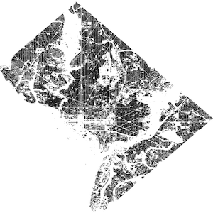
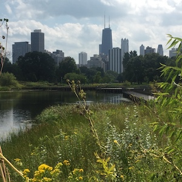
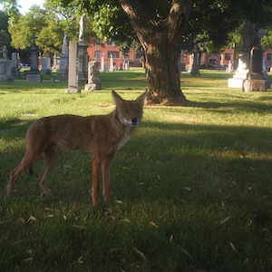
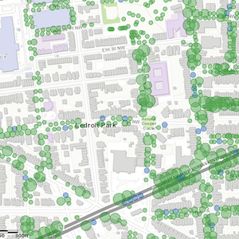

```{r setup, include=FALSE}
knitr::opts_chunk$set(echo = FALSE)
```

<style>
d-title, d-byline {
  display: none
}
</style>

<br>

# Current Research
<div class="wrapper">

<div>
<a href = uwin.html>
<div class="polaroid">

<div class="container">
<h4>National Capital UWIN</h4>
</div>
</div>
</a>
</div>

<div>
<a href = ecology-in-cities.html>
<div class="polaroid">

<div class="container">
<h4>Ecology in Cities</h4>
</div>
</div>
</a>
</div>

<div>
<a href = animal-behavior.html>
<div class="polaroid">

<div class="container">
<h4>Behavioral adaptation of urban species</h4>
</div>
</div>
</a>
</div>

<div>
<a href = ecoystem-services.html>
<div class="polaroid">

<div class="container">
<h4>Distribution of ecosystem services</h4>
</div>
</div>
</a>
</div>

</div>
