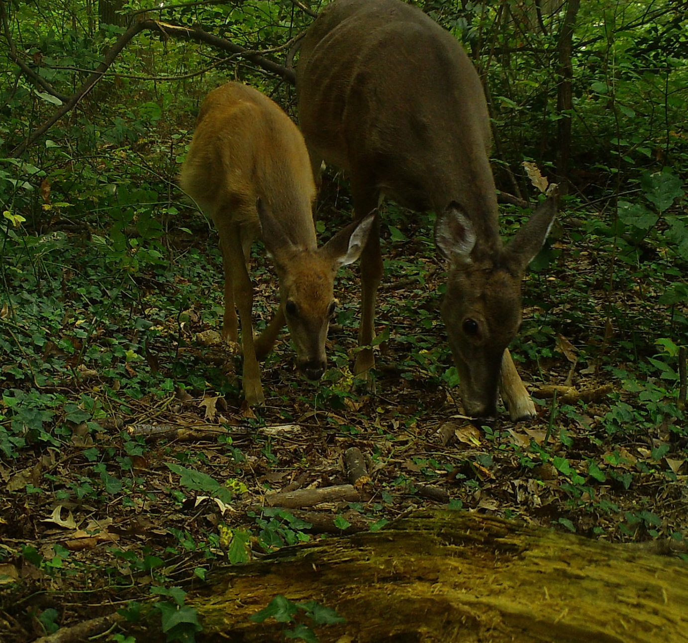

```{r setup, include=FALSE}
knitr::opts_chunk$set(echo = FALSE)
```

<style>
d-title, d-byline {
  display: none
}
</style>

<br>

````{r, fig.align = "center", out.width = "75%"}

```

### **To report an injured deer with a collar please email tgallo@umd.edu and wildlife@umd.edu**

[Lea esta página en español](https://urbanxnaturelab.com/deer-study-espanol.html)

# Urban Deer Movement & Disease Dynamics

White-tailed deer are common, widespread, and often found at high densities in urban and suburban areas. The high density of both people and deer in urban areas increases the potential for human-deer interactions, and thus the potential for disease transmission between them. The University of Maryland's URBANxNATURE Lab and Applied Spatial Wildlife Ecology Lab have collaborated with the U.S. Department of Agriculture, National Park Service, Washington D.C. Department of Energy and Environment, Fairfax County Park Authority, and Montgomery Parks to study the potential transmission of disease between humans and deer in urban settings where deer and human interactions are likely high. For this project we will be using SARS-CoV-2 as a case study.
 
Our first objective is to identify where and when humans and deer come in close contact. To achieve this, we will capture and attach GPS collars on white-tailed deer in Washington, D.C. and the urban areas of Montgomery County, Maryland and Fairfax County, Virginia. We will then combine deer movement data with human mobility data to identify where deer and humans share the same space and are active at the same time.  

We will capture deer using drop nets (Fig. 1) in D.C. and Montgomery County. You may come across a net set up similar to the photo below. If you do, please do not approach or touch the net.

````{r, fig.align = "center", out.width = "75%", fig.cap="Example of a drop net that will be used to capture deer in the Washington, D.C. region"}
knitr::include_graphics("images/projects/netSet.jpeg")
```

Once captured, trained professionals will anesthetize each deer, take nasal and oral swabs, and place a GPS collar on the deer (Fig. 2). Each deer will be continuously monitored during the work up. Once a collar has been placed on the deer, the anesthesia will be reversed and deer will be released. Deer will be monitored until they saunter off into the woods and are back to normal. Each collared deer will be tracked for the next 2 years.

````{r, fig.align = "center", out.width = "75%", fig.cap="Biologist placing GPS collars on white-tailed deer"}
knitr::include_graphics("images/projects/deerwork.jpg")
```

We also want to identify different groups of urban residents that come in close contact with deer and classify the different types of human-deer interactions. We will conduct field observations and interviews in areas of high human-deer overlap to document the different types of human-deer interactions (e.g., feeding, keeping a distance, pet-deer interactions) and provide context to these interactions (e.g., dog walkers, active commuters, outdoor enthusiasts, utility workers). 

Finally, all of this information will be used to develop and implement an agent-based modeling framework (Fig. 3) that allows us to predict 1) when and where humans and deer may come in close contact, 2) the context of such interactions, and 3) the risk of disease transmission.

````{r, fig.align = "center", out.width = "75%", fig.cap="A conceptual overview of the proposed agent-based modeling framework"}
knitr::include_graphics("images/projects/Figure_3.jpeg")
```

The potential for zoonotic spillover is highest for humans who come into frequent and direct contact with wildlife and is especially high in urban environments due to greater densities of both humans and wildlife. The nature of human-wildlife interactions in urban environments has been understudied compared to that in rural settings (among hunters and captive animal industries). Thus, understanding the frequency and nature of human-wildlife interactions in urban environments and the associated risks of zoonotic disease spillover is critical to identify effective interventions to prevent transmission of zoonotic diseases at the human-wildlife interface.

As the project progresses we will update this page and include some interactive maps of deer moving through the city. In the meantime, feel free to shoot us an email if you have any other questions.

````{r, fig.align = "center", out.width = "100%"}
knitr::include_graphics("images/projects/group_logos.png")
```
