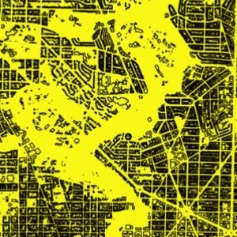

```{r setup, include=FALSE}
knitr::opts_chunk$set(echo = FALSE)
```

<style>
d-title, d-byline {
  display: none
}
</style>

<br>

````{r, fig.align = "center", out.width = "60%"}

```

# Urban Landscape Ecology

Scale matters! And in highly heterogeneous and dynamic ecosystems like cities, scale may play an even bigger role in ecological processes. We take a landscape ecology approach to most of our research questions, asking at what scale should conservation actions occur? For example, do animal and plant communities differ across a city or between neighborhoods. Do they even differ between front yards and backyards? Do animals select habitat at varying scales, and which scale is most important for habitat management and conservation? Conservation actions may be ill-informed and miss their mark if they do not account for species-specific
scale dependencies. Therefore, understanding the scale at which species respond to the environment is critical for urban reconciliation.